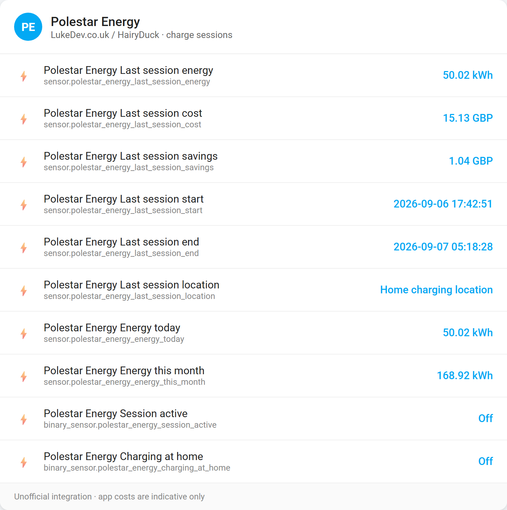

# Polestar Energy

This application is not an official app affiliated with Polestar or Jedlix.

A [LukeDev.co.uk](https://lukedev.co.uk/) / [HairyDuck](https://github.com/HairyDuck) Home Assistant integration for **Polestar Energy** charge sessions (energy used, session times, home vs away).

This is **separate** from the car telemetry integration [pypolestar/polestar_api](https://github.com/pypolestar/polestar_api) (battery, location, odometer, and so on). Use that for the car. Use **this** for charge-session data from the Polestar Energy / Jedlix smart-charging app.

N.B. Cost and savings values from the app are **indicative only**. Prefer your wallbox / electricity meter sensors for billing. The underlying API is unofficial and may change when the mobile app is updated.

## Screenshots

### Setup

Paste the Polestar ID redirect URL after signing in:

### Result

### Entities

## Use your Polestar account

Use the same Polestar ID you use in the Polestar Energy app on your phone. You can check login here: https://polestarid.eu.polestar.com/Account/login

## Prerequisites

* HACS (Home Assistant Community Store) must be installed. If you have not installed HACS yet, follow the [official HACS installation guide](https://hacs.xyz/docs/use/#getting-started-with-hacs).

## Add in HA Integration

### Custom repository (until listed in HACS by default)

1. HACS → Integrations → ⋮ → **Custom repositories**
2. Repository: `https://github.com/HairyDuck/polestar-energy`
3. Category: **Integration**
4. Download **Polestar Energy**
5. Restart Home Assistant
6. Settings → Devices & services → **Add integration** → **Polestar Energy**

### Fill the information

1. Open the login URL shown in the config flow
2. Sign in with your Polestar ID
3. After login, copy the full redirect URL that starts with `com.polestar.smartcharging://`
4. Paste it into the Home Assistant form

Tokens are stored in Home Assistant and refreshed automatically.

## What you get

* Last session energy (kWh), start/end, location
* Last session cost / savings from the app (indicative)
* Energy today / this month from session history
* Binary: session active
* Binary: charging at home (active session at a configured home address)

## Manual install

Clone or copy this repository and copy the folder `custom_components/polestar_energy` into your Home Assistant `custom_components` directory, then restart and add the integration as above.

## Support

* Issues: https://github.com/HairyDuck/polestar-energy/issues
* Author: [HairyDuck](https://github.com/HairyDuck) · [LukeDev.co.uk](https://lukedev.co.uk/)

## License

MIT – see [LICENSE](LICENSE).
