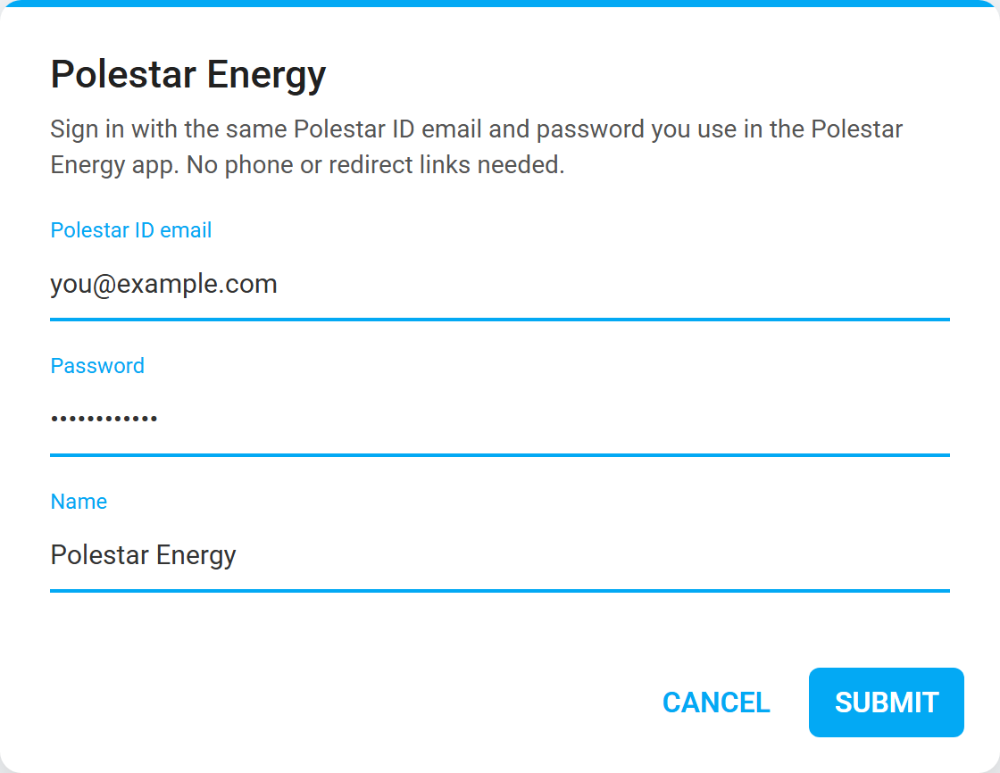
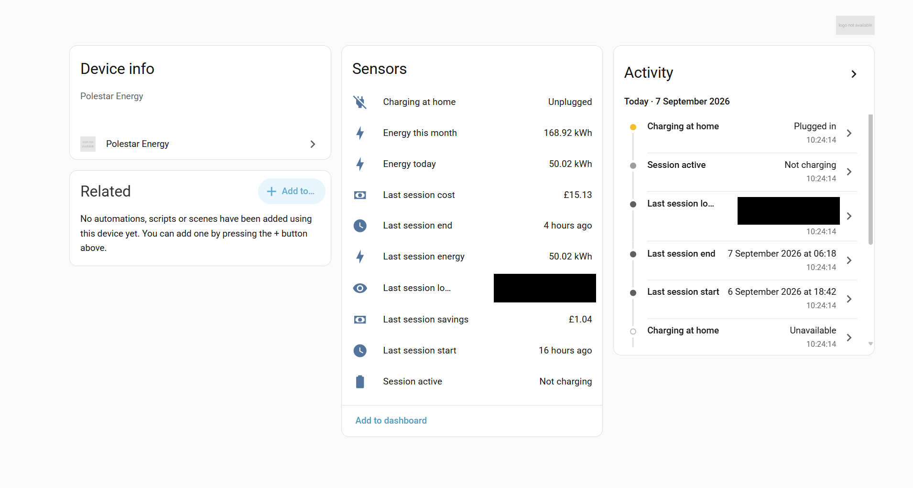
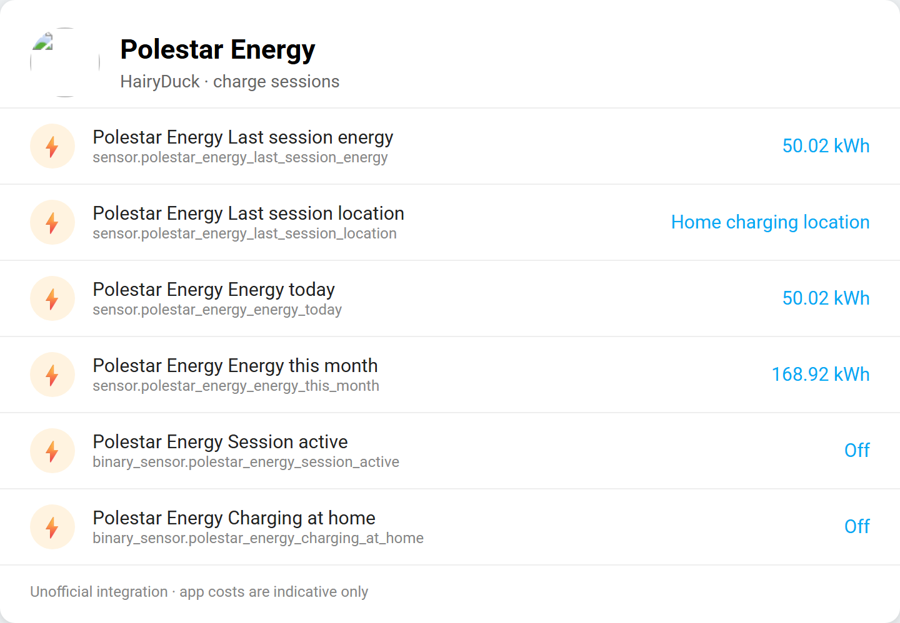

# Polestar Energy – Home Assistant integration

This is a custom component to get **Polestar Energy** charge-session information into [Home Assistant](https://home-assistant.io).

Built by [LukeDev.co.uk](https://lukedev.co.uk/) / [HairyDuck](https://github.com/HairyDuck).

Not affiliated with Polestar or Jedlix. Complementary to [pypolestar/polestar_api](https://github.com/pypolestar/polestar_api) (car data), not a replacement for it.

## Installation

### Install using HACS (recommended)

If you do not have HACS installed yet, visit https://hacs.xyz for installation instructions.

1. In HACS go to **Integrations** → ⋮ → **Custom repositories**
2. Add `https://github.com/HairyDuck/polestar-energy` as category **Integration**
3. Search for **Polestar Energy** and download it
4. Restart Home Assistant

### Install manually

Clone or copy this repository and copy the folder `custom_components/polestar_energy` into `/config/custom_components/`.

## Configuration

Once installed, configure via **Settings → Devices & services → Add integration → Polestar Energy**.

Enter your Polestar ID email and password (same as the Polestar Energy app). No phone or redirect links required.

